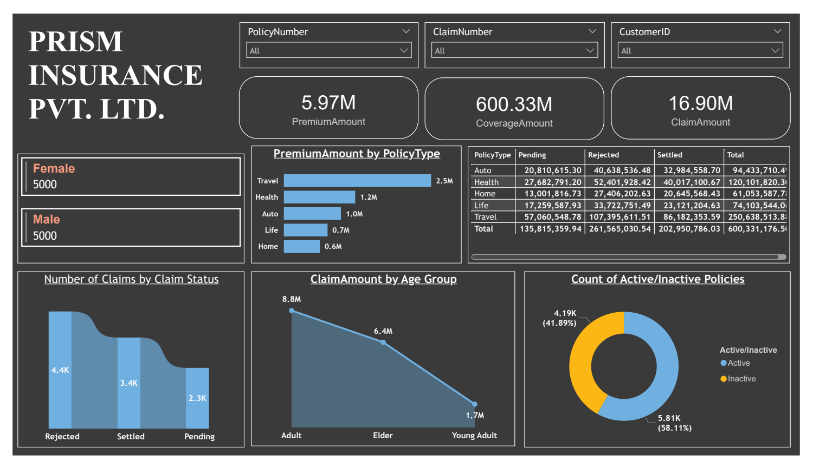
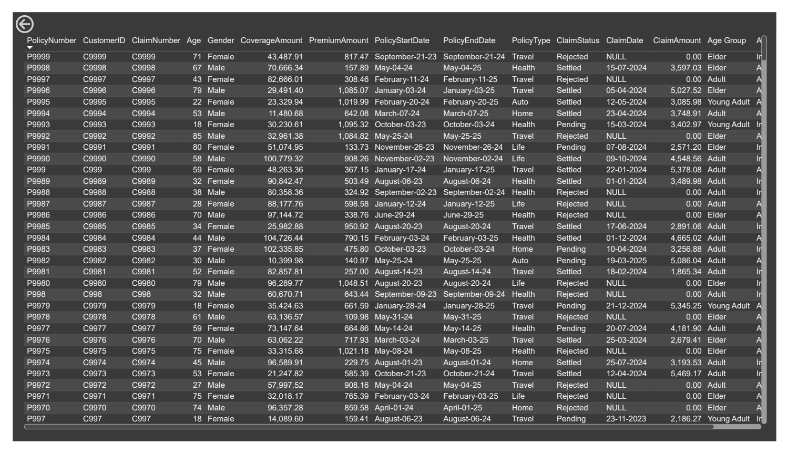
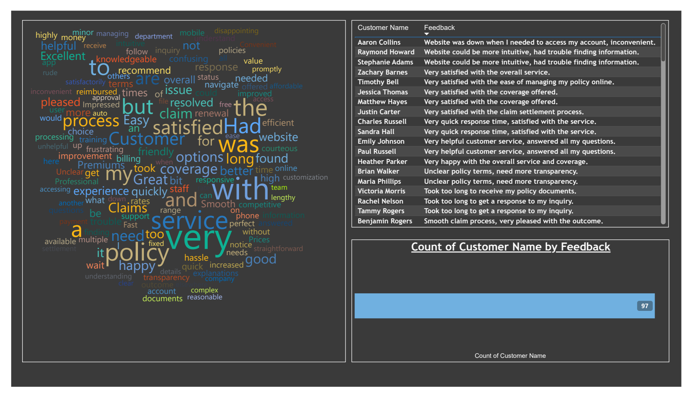

# Insurance Data Analysis – Power BI Dashboard

## Project Summary
This project delivers an end-to-end insurance analytics solution using SQL and Power BI to analyze policy performance, claims behavior, and customer sentiment for strategic decision-making.

The dashboard helps stakeholders understand:
- Premium revenue performance
- Claim distribution and status
- Policy activity trends
- Customer segmentation
- Customer sentiment insights

### Business Objectives
This dashboard addresses critical business questions such as:
- Policy performance by type
- Claim approval and rejection patterns
- Active vs inactive customers
- Revenue (Premium) vs Claim payouts
- Customer satisfaction trends

The solution provides management with a centralized, data-driven decision support system.

### Tools & Technologies
- MySQL Server – Data storage
- SQL – Data querying
- Power BI Desktop
- Power Query
- DAX
- Power BI Service (Publishing + RLS + Scheduled Refresh)

### Data Modeling
- Designed star schema model
- Created relationships between Policy, Claims, and Customer tables
- Implemented calculated columns and DAX measures

### Dataset Overview
- Total Policies: 10,000
- Total Customers: 10,000
- Total Claims: 5646
- Data Time Range: July 2023–July 2025

### Technical Highlights
- Built dynamic KPI cards using DAX
- Implemented drill-through and cross-filtering
- Used Power Query for data transformation
- Applied Row-Level Security (RLS)
- Created sentiment analysis using AI Text Analytics

### Row-Level Security (RLS) Implementation
To ensure data confidentiality, Row-Level Security (RLS) was implemented so that each manager can view only the specific Policy Type relevant to them.

Implementation Steps:
1. Created roles in Power BI Desktop and applied filters based on PolicyType.
2. Tested role behavior using “View as Role” in Power BI Desktop.
3. Published the report to Power BI Service.
4. Assigned users to respective roles and validated access permissions in Power BI Service.

### Key Insights
- Total Premium Revenue: 5.97M
- Total Coverage Value: 600.33M
- Total Claims Paid: 16.90M
- Travel policies generated the highest premium revenue.
- Majority of policies are Active (58%).
- Rejected claims are higher than pending claims.
- Adult age group contributes the highest claim amount.

## Dashboard Snapshots (Power BI)
### Insurance Dashboard Overview

Main Insurance Dashboard Overview
**Highlights:**
- KPI cards (Premium, Coverage, Claim Amount)
- PolicyType revenue breakdown
- Claim Status distribution
- Claim Amount by Age Group
- Active vs Inactive policies

### Policy & Claims Analysis

Features:
- Drill-through functionality by PolicyType
- Non-aggregated fields
- Policy Start/End tracking
- Claim history tracking

### Customer Feedback Analysis

Implemented:
- Power BI AI Text Analytics
- Sentiment scoring (0 to 1 scale)
- Categorized feedback:
	- Excellent
	- Good
	- Needs Improvement

Insight:
- Majority feedback is positive
- Common issues: response delay & policy documentation clarity

### Dataset Features
- Policy Number
- Customer ID
- Policy Type
- Claim Status
- Coverage Amount
- Premium Amount
- Claim Amount
- Age Group
- Customer Feedback

### Business Insights Summary
- Travel policies contribute the highest premium revenue.
- Adult age group generates maximum claims.
- Rejected claims require further process review.
- Active policies significantly outperform inactive.
- Customer satisfaction is generally positive but operational delays exist.
